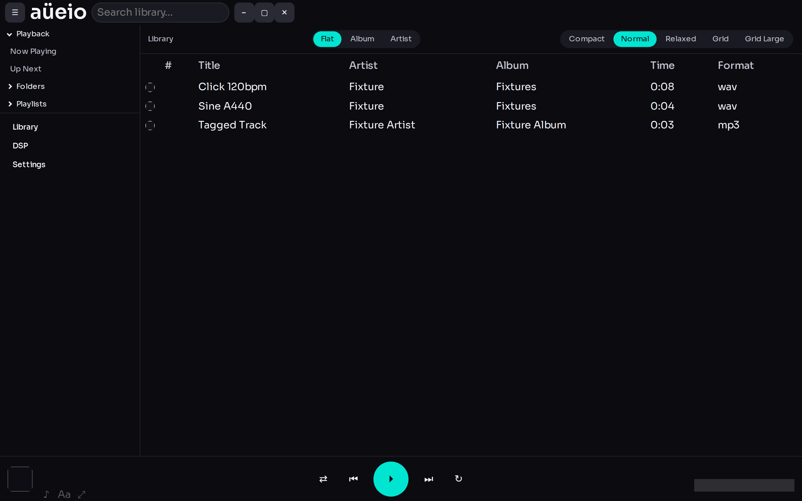
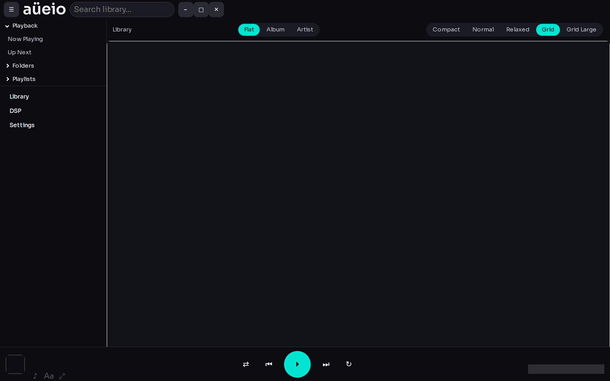
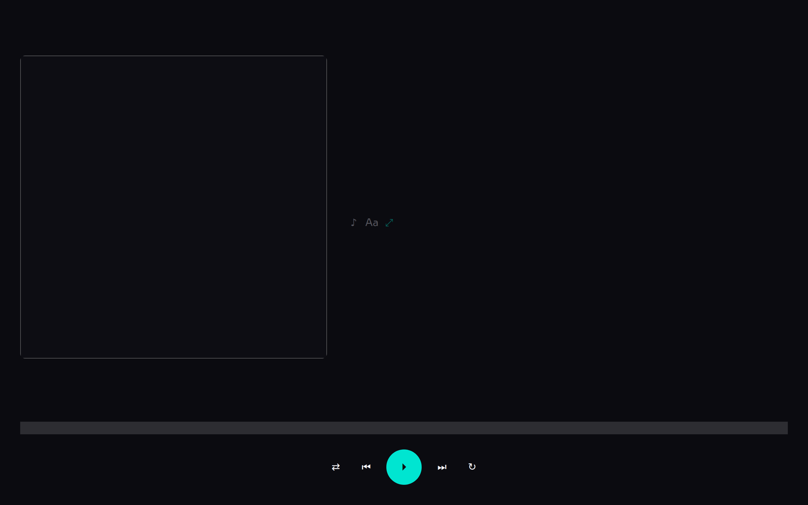
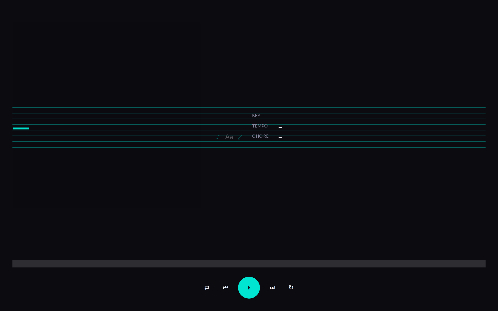
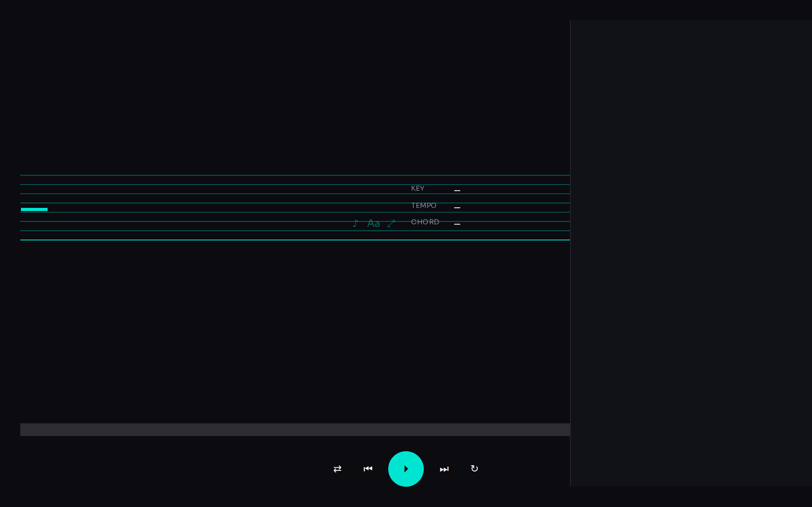
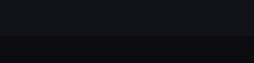
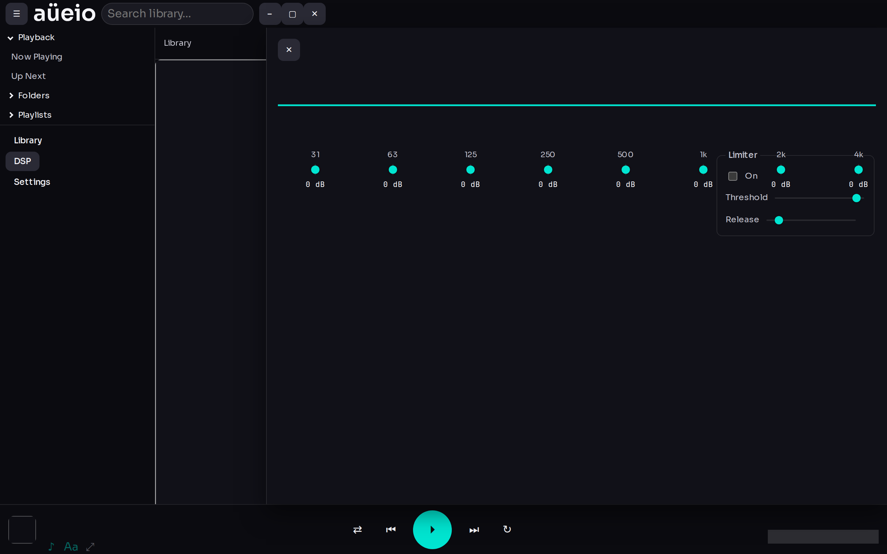
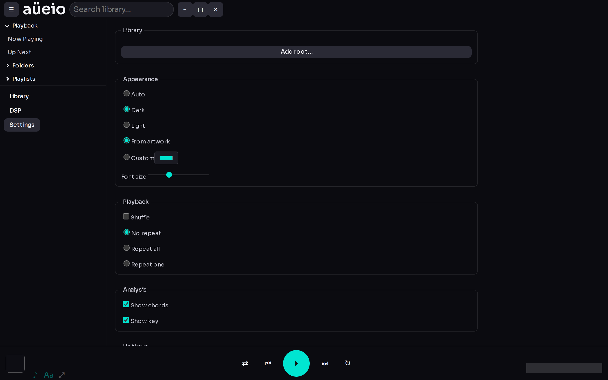
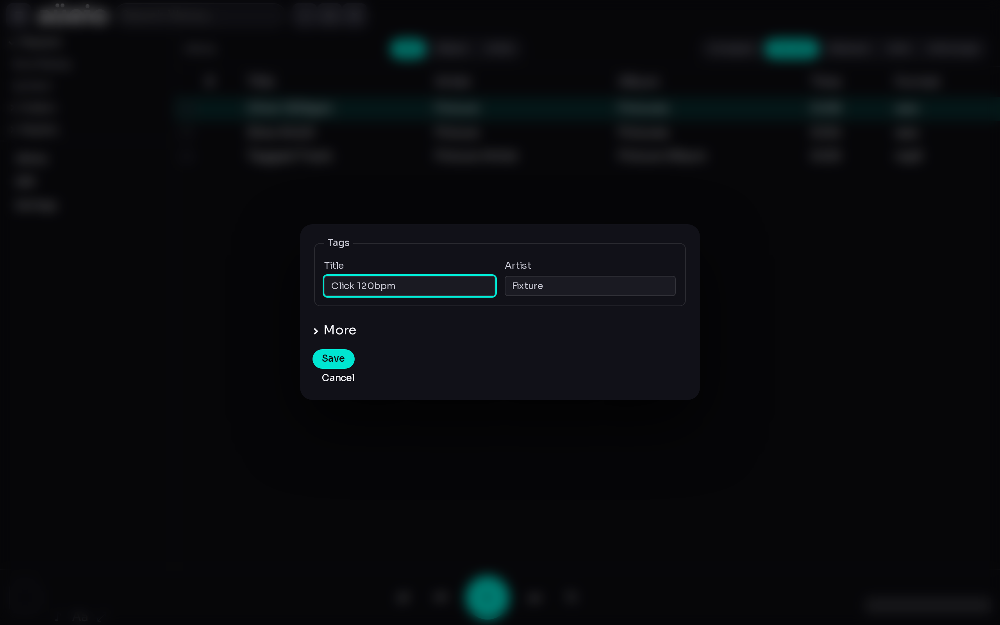

# aüeio player

A lightweight desktop music player: library scanning, a now-playing view with
a chord/key/tempo analysis mode and a lyrics layer, a slim 10-band DSP page,
playlists, tag editing, and an accent colour lifted straight from the
playing track's artwork.

Built on [Electrobun 2](https://electrobun.dev) (Bun main process, system
WebKit webview) and React 19 — a from-scratch, deliberately smaller rebuild
of `desktop-audio`. Two views (album art, chord/key/tempo analysis) share one
layer (lyrics, on the trailing edge); the player renders one markup for both
the footer bar and the expanded overlay. Full keyboard control ships with
twelve default bindings, editable in Settings → Hotkeys. See
[`docs/plans/desktop-audio-migration.md`](./docs/plans/desktop-audio-migration.md)
for the complete spec and the reasoning behind every cut feature.

Bun only — never npm, yarn, or pnpm.

## Download

Grab the latest build from
[**GitHub Releases**](https://github.com/tuomashatakka/aueio-player-desktop/releases/latest):

| Platform | Asset |
|---|---|
| macOS (Apple Silicon) | `macos-arm64-AueioPlayer.dmg` |
| Windows (x64) | `windows-x64-AueioPlayer.zip` *(as published by CI)* |
| Linux (x64) | `linux-x64-AueioPlayer.tar.gz` *(as published by CI)* |

Only the macOS asset name above is confirmed from a real build; the Windows
and Linux names follow the same `<os>-<arch>-AueioPlayer.<ext>` convention
the CI build matrix produces, but check the release page if a name doesn't
match.

## Screenshots

| | |
|---|---|
| Library — list | Library — grid |
|  |  |
| Now playing — album art | Now playing — analysis |
|  |  |
| Now playing — lyrics | Waveform |
|  |  |
| DSP | Settings |
|  |  |
| Tag editor | |
|  | |

Screenshots are generated by `bun run screenshots` (drives a static
`build/web` build through Playwright) and written to `docs/screenshots/`;
some of the files above may not exist yet in a fresh checkout until that
script has been run.

## Development

```bash
bun install
bun run dev                # hutch electrobun dev --watch
bun run check               # lint + typecheck + unit tests
bun run test:e2e             # playwright, against a static build/web build
bun run screenshots           # regenerate docs/screenshots/*.png
bun run build:stable           # production build (hutch electrobun build --env=stable)
```

## Architecture

See [`AGENTS.md`](./AGENTS.md) for the folder map, the unidirectional
data-flow rules and their lint enforcement, the RPC contract, persistence,
the CSS layer system, and testing conventions, and
[`docs/plans/desktop-audio-migration.md`](./docs/plans/desktop-audio-migration.md)
for the full design spec. Also see
[`docs/keybindings.md`](./docs/keybindings.md),
[`docs/music-analysis.md`](./docs/music-analysis.md) and
[`docs/css-architecture.md`](./docs/css-architecture.md).

## License

No license file has been published for this repository yet. All rights
reserved by the author until one is added.
